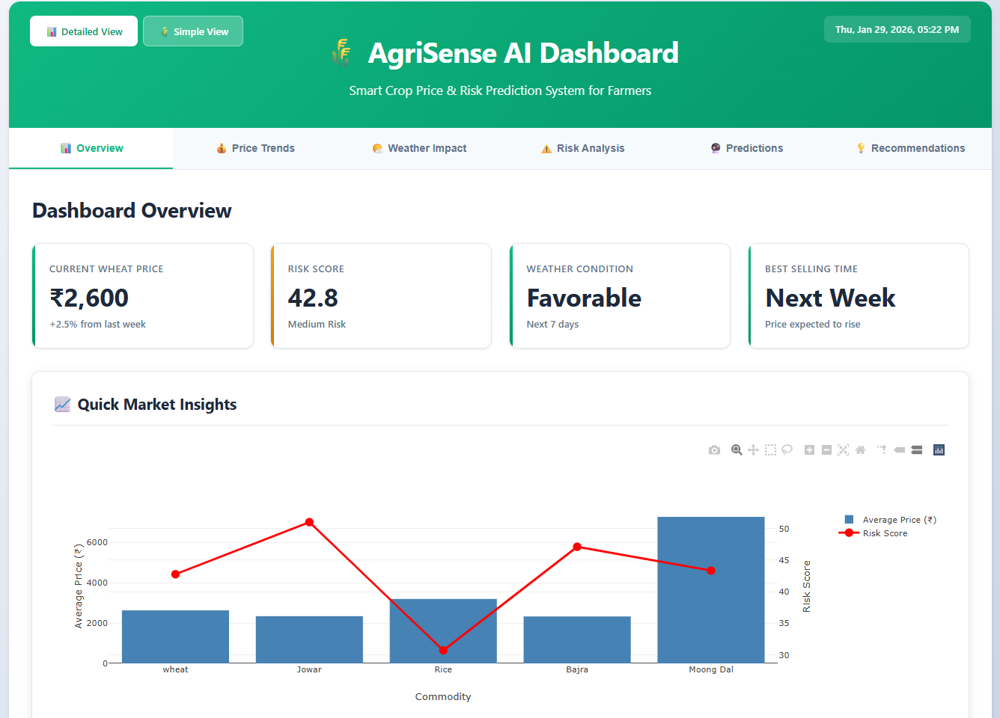
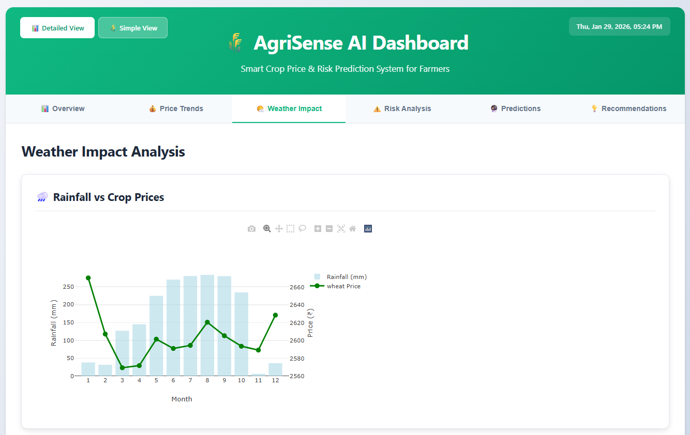

# 🌾 AgriSense AI - Crop Price & Risk Prediction

Smart agricultural dashboard system with multi-language support for farmers.

## 🌐 Live Demo

**[🚀 View Live Dashboard](https://agrisensehelper.netlify.app/)**

## 🚀 Quick Start

Open `index.html` in your browser to access the main dashboard locally.

## 📸 Dashboard Screenshots

### Modern Dashboard (Detailed View)


*Comprehensive analytics with price trends, weather impact, and predictions*

### Simple Farmer Dashboard (English)


*Easy-to-understand interface with clear sell/wait decisions*

### Simple Farmer Dashboard (Marathi)


*Multi-language support for local farmers (मराठी)*

---

## 📂 Project Structure

```
AgroPredict AI/
│
├── index.html                    # Main Entry Point (Modern Dashboard)
│
├── dashboards/                   # Dashboard Files
│   ├── Simple_Farmer_Dashboard.html   # Simple view with EN/MR support
│   ├── Farmer_Dashboard_Modern.html   # Detailed analytics view
│   └── Farmer_Dashboard.html          # Legacy dashboard
│
├── data/                         # Data Files
│   ├── Crop_Dataset_Cleaned.csv
│   ├── Maharashtra_Weather_Cleaned.csv
│   ├── Merged_Crop_Weather_Data.csv
│   ├── Risk_Analysis_Results.csv
│   └── ... (other CSV files)
│
├── scripts/                      # Python Scripts
│   ├── data_cleaning_fixed.py
│   ├── data_merging_fixed.py
│   ├── exploratory_data_analysis.py
│   ├── feature_engineering.py
│   ├── model_training.py
│   ├── risk_analysis.py
│   ├── time_series_forecasting.py
│   ├── farmer_recommendations.py
│   └── interactive_farmer_dashboard.py
│
├── reports/                      # Analysis Reports & Visualizations
│   ├── Farmer_Recommendations_Report.txt
│   └── ... (PNG files)
│
└── models/                       # ML Models (if any)
```

## 🎯 Dashboard Features

### Modern Dashboard (index.html)
- 📊 Detailed analytics and visualizations
- 💰 Price trend analysis
- 🌤️ Weather impact tracking
- ⚠️ Risk analysis
- 🔮 Future predictions
- 💡 Smart recommendations

### Simple Farmer Dashboard
- 🌾 Easy-to-understand interface
- 🗣️ Multi-language support (English + Marathi)
- 📈 Quick price insights
- ⏰ Clear sell/wait decisions
- 🚦 Simple risk indicators

## 🌍 Language Support

The Simple Farmer Dashboard supports:
- **English (EN)** - Default
- **Marathi (MR)** - मराठी

Toggle between languages using the EN/MR buttons.

## 🔄 Switching Views

- From **Modern Dashboard**: Click "🌾 Simple View" button
- From **Simple Dashboard**: Click "📊 Detailed View" link

## 📊 Key Translations

| English | Marathi (मराठी) |
|---------|-----------------|
| WAIT | थांबा |
| SELL NOW | आता विक्री करा |
| HIGH RISK | धोका जास्त आहे |
| Today's Price | आजचा दर |
| Risk Level | धोका पातळी |
| Price Trend | दराचा कल |

## 🛠️ Technologies Used

- HTML5, CSS3, JavaScript
- Python (Data Analysis & ML)
- Plotly.js (Visualizations)
- Multi-language support

## 👨‍🌾 Target Users

- Local farmers
- Agricultural consultants
- Crop price analysts
- Rural development workers

## 📝 Notes

- All predictions are data-driven
- Weather data impacts price forecasts
- Risk analysis considers multiple factors
- Simple view prioritizes farmer usability

---

**Built with ❤️ for farmers**
